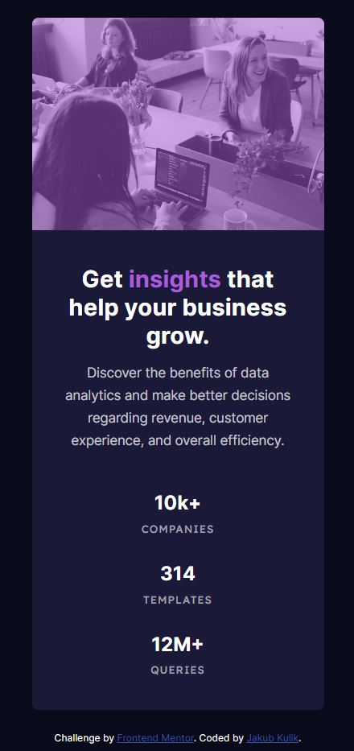
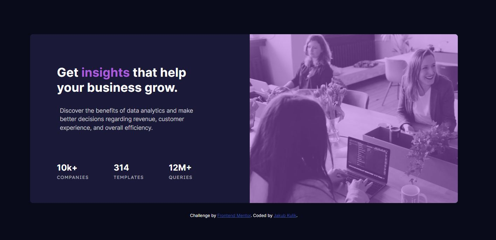

# Frontend Mentor - Stats preview card component solution

This is a solution to the [Stats preview card component challenge on Frontend Mentor](https://www.frontendmentor.io/challenges/stats-preview-card-component-8JqbgoU62). Frontend Mentor challenges help you improve your coding skills by building realistic projects. 

## Table of contents

- [Overview](#overview)
  - [The challenge](#the-challenge)
  - [Screenshot](#screenshot)
  - [Links](#links)
- [My process](#my-process)
  - [Built with](#built-with)
  - [What I learned](#what-i-learned)
  - [Continued development](#continued-development)
- [Author](#author)

## Overview

### The challenge

Users should be able to:

- View the optimal layout depending on their device's screen size

### Screenshot

Mobile:

Desktop:

### Links

- Solution URL: [Add solution URL here](https://your-solution-url.com)
- Live Site URL: [Add live site URL here](https://your-live-site-url.com)

## My process

### Built with

- HTML5
- SCSS
- Flexbox
- Mobile-first workflow

### What I learned

In this project I trained flexbox with different flex directions, depends on moblie or desktop version.
The trickiest part of this project was adding purple filter on hero image. The best way I found is making a purple background with higher z-index than photography, and make it opacity. To be honest, I am not really delight of result I achieved, maybe is the better way to do this? It is quite different color than challenge template.

### Continued development

I haven't got plans to continue developing of this challenge solution. The only thing that I can improve in future is purple filter on hero img.

## Author

- Website - [Github](https://github.com/abuk111)
- Frontend Mentor - [@abuk111](https://www.frontendmentor.io/profile/abuk111)
- Twitter - [@JakubKulik94](https://twitter.com/JakubKulik94)

